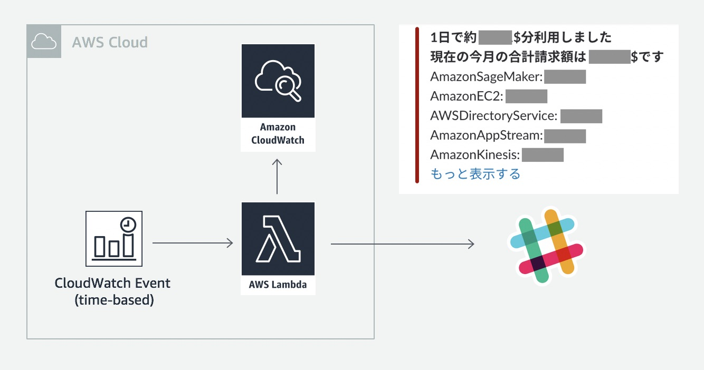

# 💰 AWS Daily Cost Watcher

You can deploy a Lambda function that posts daily AWS cost to your Slack with 1 click. The function is invoked at a specified time everyday, and it notifies you of daily cost (total / by service) and total cost for this month. Note that the cost is an estimated value and not so accurate.
- **Easy to Use**
- **Free** (This system runs on AWS Free Tier)

## How to Use

1. Get Slack webhook URL from [this link](https://slack.com/services/new/incoming-webhook).
2. If you have not enabled Billing Alerts, please see [this document](https://docs.aws.amazon.com/AmazonCloudWatch/latest/monitoring/gs_monitor_estimated_charges_with_cloudwatch.html) and enable it.
3. Click the following button. You can launch **AWS Daily Cost Watcher** using CloudFormation.

## Architecture

## Customize
If you're interested in customizing this app, use `scripts/deploy.sh` to deploy customized code to your AWS environment. 

